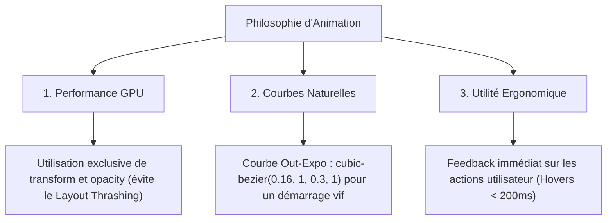

# ⚡ Spécifications des Micro-interactions et Animations

Ce document définit les règles d'interaction dynamique, les transitions et les animations du portfolio de **Maxence Coste** (BUT MMI - Parcours Développement Web & Dispositifs Interactifs).

Ces directives garantissent une expérience utilisateur **vivante, mémorable et premium (effet "Wow")**, tout en maintenant des performances de rendu optimales (60 FPS) et une accessibilité exemplaire.

---

## 🧭 1. Principes de Mouvement et Accélération

Pour refléter la rigueur technique du développement web et la fluidité des dispositifs interactifs, la charte de mouvement repose sur trois piliers :



### 📈 Courbe d'Accélération Core

Toutes les transitions standardisées du portfolio utilisent la variable globale `--transition-smooth` définie dans les maquettes :

```css
:root {
  --transition-smooth: all 0.4s cubic-bezier(0.16, 1, 0.3, 1);
  --transition-fast: all 0.2s cubic-bezier(0.16, 1, 0.3, 1);
}
```

- **Comportement** : La transition démarre instantanément pour donner un ressenti ultra-réactif, puis décélère de manière très douce lors des derniers 70% de la durée.

---

## 🌌 2. Micro-interactions Globales du Site

### 2.1 Curseur Fluide Personnalisé (Custom Cursor)

Sur les écrans de bureau (Desktop, sans écran tactile), un curseur personnalisé remplace le pointeur par défaut pour ajouter une dimension interactive immédiate.

- **Structure HTML** :

  ```html
  <div class="custom-cursor" id="custom-cursor"></div>
  <div class="custom-cursor-follower" id="cursor-follower"></div>
  ```

- **Style CSS** :

  ```css
  .custom-cursor {
    width: 8px;
    height: 8px;
    background: var(--accent-secondary, #10b981); /* Vert menthe */
    border-radius: 50%;
    position: fixed;
    pointer-events: none;
    z-index: 9999;
    transform: translate(-50%, -50%);
    transition:
      width 0.2s,
      height 0.2s,
      background-color 0.2s;
  }

  .custom-cursor-follower {
    width: 32px;
    height: 32px;
    border: 1px solid var(--accent-primary, #6366f1); /* Indigo */
    background: rgba(99, 102, 241, 0.03);
    border-radius: 50%;
    position: fixed;
    pointer-events: none;
    z-index: 9998;
    transform: translate(-50%, -50%);
    transition:
      transform 0.08s ease-out,
      width 0.3s,
      height 0.3s,
      border-color 0.3s;
  }
  ```

- **Changement d'état au survol d'un élément cliquable (`a`, `button`, `.bento-card`)** :

  ```css
  /* Appliqué via JavaScript */
  .custom-cursor.hovering {
    width: 4px;
    height: 4px;
    background: var(--accent-primary);
  }

  .custom-cursor-follower.hovering {
    width: 48px;
    height: 48px;
    border-color: var(--accent-secondary);
    background: rgba(16, 185, 129, 0.05);
    box-shadow: 0 0 15px rgba(16, 185, 129, 0.2);
  }
  ```

- **Script d'animation fluide (Lag Effect)** :

  ```javascript
  const cursor = document.getElementById('custom-cursor');
  const follower = document.getElementById('cursor-follower');

  let mouseX = 0,
    mouseY = 0;
  let followerX = 0,
    followerY = 0;

  window.addEventListener('mousemove', (e) => {
    mouseX = e.clientX;
    mouseY = e.clientY;

    // Position immédiate pour le point central
    cursor.style.left = mouseX + 'px';
    cursor.style.top = mouseY + 'px';
  });

  // Animation avec inertie (RequestAnimationFrame) pour le cercle externe
  function animateFollower() {
    const ease = 0.15; // Coefficient d'amortissement
    followerX += (mouseX - followerX) * ease;
    followerY += (mouseY - followerY) * ease;

    follower.style.left = followerX + 'px';
    follower.style.top = followerY + 'px';

    requestAnimationFrame(animateFollower);
  }
  animateFollower();
  ```

---

### 2.2 Barre de Progression du Défilement (Scroll Progress Bar)

Un indicateur discret en haut de la page montre le niveau de lecture à l'utilisateur.

```text
+---------------------------------------------------------+
| [===== Scroll Progress Indicator (63%) ====>          ] |  <- Hauteur: 3px, Couleur: Indigo
+---------------------------------------------------------+
|                                                         |
|   Contenu du Portfolio...                               |
```

- **CSS** :

  ```css
  .scroll-progress-container {
    position: fixed;
    top: 70px; /* Aligné juste sous la Navbar */
    left: 0;
    width: 100%;
    height: 3px;
    background: transparent;
    z-index: 1001;
    pointer-events: none;
  }

  .scroll-progress-bar {
    height: 100%;
    width: 0%;
    background: linear-gradient(90deg, var(--accent-primary) 0%, var(--accent-secondary) 100%);
    box-shadow: 0 1px 8px rgba(99, 102, 241, 0.5);
  }
  ```

- **JS d'Intégration** :
  ```javascript
  window.addEventListener('scroll', () => {
    const winScroll = document.body.scrollTop || document.documentElement.scrollTop;
    const height = document.documentElement.scrollHeight - document.documentElement.clientHeight;
    const scrolled = (winScroll / height) * 100;
    document.querySelector('.scroll-progress-bar').style.width = scrolled + '%';
  });
  ```

---

## 🧱 3. Animations de la Bento Grid

La Bento Grid de la page d'accueil est la pièce maîtresse visuelle. Elle doit paraître vivante et réagir aux actions de l'utilisateur.

### 3.1 Apparition Progressive au Défilement (Scroll Entrance)

Les cartes Bento n'apparaissent pas de manière abrupte, mais glissent avec élégance lors du premier chargement ou au scroll.

```text
[ Hors Écran ]                       [ Entre dans le Viewport ]
+-------------+                      +-------------+
|             |                      |  Fade In    |  Opacity: 0 -> 1
|             |  === Scroll Up ===>  |     +       |  TranslateY: 30px -> 0px
|             |                      |  Slide Up   |  Timing: 0.8s (Out-Expo)
+-------------+                      +-------------+
```

- **CSS** :

  ```css
  .bento-card-animate {
    opacity: 0;
    transform: translateY(30px);
    transition:
      opacity 0.8s cubic-bezier(0.16, 1, 0.3, 1),
      transform 0.8s cubic-bezier(0.16, 1, 0.3, 1);
  }

  .bento-card-animate.visible {
    opacity: 1;
    transform: translateY(0);
  }
  ```

- **JS (Intersection Observer pour un chargement décalé - Staggered)** :

  ```javascript
  const cards = document.querySelectorAll('.bento-card-animate');
  const observerOptions = {
    threshold: 0.1,
    rootMargin: '0px 0px -50px 0px',
  };

  const observer = new IntersectionObserver((entries, observer) => {
    entries.forEach((entry, index) => {
      if (entry.isIntersecting) {
        // Effet de décalage temporel (stagger) pour l'apparition des cartes
        setTimeout(() => {
          entry.target.classList.add('visible');
        }, index * 100);
        observer.unobserve(entry.target);
      }
    });
  }, observerOptions);

  cards.forEach((card) => observer.observe(card));
  ```

---

### 3.2 Effet de Spot Lumineux Curseur (Hover Spotlight Effect)

Un halo lumineux doux (radial-gradient) suit la position de la souris à l'intérieur de chaque carte Bento pour simuler une surface en verre réactive.

```text
+---------------------------------------+
|  Bento Card                           |
|                                       |
|             * [Curseur]               |
|            / \                        |
|           /   \  Radial Glow (6%)     |
|          /     \                      |
|                                       |
+---------------------------------------+
```

- **CSS** (intégré dans les maquettes Hi-Fi) :

  ```css
  .bento-card::before {
    content: '';
    position: absolute;
    top: 0;
    left: 0;
    right: 0;
    bottom: 0;
    background: radial-gradient(
      800px circle at var(--x, 50%) var(--y, 50%),
      rgba(99, 102, 241, 0.08),
      transparent 40%
    );
    z-index: 1;
    pointer-events: none;
    opacity: 0;
    transition: opacity 0.3s ease;
  }

  .bento-card:hover::before {
    opacity: 1;
  }
  ```

- **JavaScript pour la mise à jour des coordonnées** :

  ```javascript
  const bentoCards = document.querySelectorAll('.bento-card');

  bentoCards.forEach((card) => {
    card.addEventListener('mousemove', (e) => {
      const rect = card.getBoundingClientRect();
      const x = e.clientX - rect.left; // Coordonnée X dans la carte
      const y = e.clientY - rect.top; // Coordonnée Y dans la carte

      card.style.setProperty('--x', `${x}px`);
      card.style.setProperty('--y', `${y}px`);
    });
  });
  ```

---

### 3.3 Inclinaison 3D Interactive (3D Card Tilt)

Sur survol Desktop, la carte Bento s'incline légèrement en trois dimensions en fonction de la position du curseur de la souris pour accentuer le relief.

- **CSS structurel requis** :

  ```css
  .bento-grid {
    perspective: 1000px; /* Permet la projection 3D */
  }

  .bento-card {
    transform-style: preserve-3d;
    will-change: transform;
  }

  /* Évite que le texte à l'intérieur ne paraisse flou */
  .bento-card > * {
    transform: translateZ(20px); /* Légère surélévation du contenu */
  }
  ```

- **JS de calcul d'inclinaison mathématique** :
  ```javascript
  bentoCards.forEach((card) => {
    card.addEventListener('mousemove', (e) => {
      const rect = card.getBoundingClientRect();
      const cardWidth = rect.width;
      const cardHeight = rect.height;

      const x = e.clientX - rect.left;
      const y = e.clientY - rect.top;

      // Calculer l'angle de rotation (Max +/- 4 degrés pour rester subtil)
      const rotateX = -((y - cardHeight / 2) / (cardHeight / 2)) * 4;
      const rotateY = ((x - cardWidth / 2) / (cardWidth / 2)) * 4;

      card.style.transform = `perspective(1000px) rotateX(${rotateX}deg) rotateY(${rotateY}deg) translateY(-5px)`;
    });

    // Réinitialiser la rotation lorsque la souris quitte la carte
    card.addEventListener('mouseleave', () => {
      card.style.transform = `perspective(1000px) rotateX(0deg) rotateY(0deg) translateY(0)`;
    });
  });
  ```

---

## 🎮 4. Animations des Composants Phares

### 4.1 Le Mini Terminal CLI Interactif

Ce terminal interactif de style rétro tape du texte de manière programmatique et fait clignoter son curseur.

- **Animation du curseur clignotant** :

  ```css
  .cli-terminal .cursor {
    display: inline-block;
    width: 8px;
    height: 15px;
    background: var(--accent-secondary, #10b981);
    animation: blink 1s step-end infinite;
    vertical-align: middle;
  }

  @keyframes blink {
    from,
    to {
      background-color: transparent;
    }
    50% {
      background-color: var(--accent-secondary);
    }
  }
  ```

- **Animation de dactylographie simulant la saisie (Typing Effect)** :
  L'effet de saisie d'une commande (ex: `npx maxence-coste`) s'exécute lorsque la carte Bento du terminal devient visible :
  ```javascript
  function typeCommand(element, text, speed = 80) {
    let i = 0;
    element.innerHTML = '';

    function type() {
      if (i < text.length) {
        element.innerHTML += text.charAt(i);
        i++;
        setTimeout(type, speed);
      } else {
        // Déclencher le faux chargement après la fin de la saisie
        showTerminalOutput();
      }
    }
    type();
  }
  ```

---

### 4.2 Le Schéma Interactif IoT (Dispositifs Interactifs)

Cette carte Bento affiche un circuit SVG symbolisant les compétences matérielles/IoT de Maxence. Il comprend deux animations distinctes :

```text
[ Capteur 1 ] ---> (Flux Lumineux Néon) ---> [ Processeur Central ]
 (Cercle Pulsant)    (Pointillés Défilants)   (Glow Vert)
```

1.  **Pulsation des capteurs (Sensors Pulse)** :

    ```css
    .iot-sensor-node {
      animation: pulse-sensor 2s infinite ease-in-out;
      transform-origin: center;
    }

    @keyframes pulse-sensor {
      0% {
        transform: scale(0.9);
        opacity: 0.6;
        filter: drop-shadow(0 0 2px var(--accent-secondary));
      }
      50% {
        transform: scale(1.1);
        opacity: 1;
        filter: drop-shadow(0 0 8px var(--accent-secondary));
      }
      100% {
        transform: scale(0.9);
        opacity: 0.6;
        filter: drop-shadow(0 0 2px var(--accent-secondary));
      }
    }
    ```

2.  **Flux néon le long des pistes de connexion (Data Stream Flow)** :
    Le tracé vectoriel SVG simule un transfert d'information avec un mouvement de tirets :

    ```css
    .iot-data-line {
      stroke-dasharray: 6, 6;
      animation: iot-flow 1.5s linear infinite;
    }

    @keyframes iot-flow {
      from {
        stroke-dashoffset: 24;
      }
      to {
        stroke-dashoffset: 0;
      }
    }
    ```

---

### 4.3 Formulaire de Contact & Champs Flottants

Pour une ergonomie de saisie premium, les labels de formulaires se transforment de manière organique au focus.

```text
État Inactif                        État Actif (:focus ou non-vide)
+-----------------------+           +-----------------------+
|  Votre Nom...         |   ====>   |  Votre Nom            |  <- Label réduit et surélevé en indigo
+-----------------------+           | [ Jean Dupont       ] |
                                    +-----------------------+
```

- **CSS des Champs Flottants** :

  ```css
  .form-group {
    position: relative;
    margin-bottom: 1.5rem;
  }

  .form-input {
    width: 100%;
    padding: 1rem;
    background: rgba(17, 24, 39, 0.4);
    border: 1px solid var(--border-color);
    border-radius: var(--radius-md);
    color: var(--text-primary);
    outline: none;
    transition: var(--transition-smooth);
  }

  .form-label {
    position: absolute;
    left: 1rem;
    top: 50%;
    transform: translateY(-50%);
    color: var(--text-muted);
    pointer-events: none;
    transition: var(--transition-smooth);
  }

  /* Animation du Label au focus ou si le champ contient du texte */
  .form-input:focus ~ .form-label,
  .form-input:not(:placeholder-shown) ~ .form-label {
    top: 0;
    left: 0.8rem;
    transform: translateY(-50%) scale(0.85);
    background: var(--bg-primary);
    padding: 0 0.4rem;
    color: var(--accent-primary);
  }

  /* Bordure lumineuse au focus */
  .form-input:focus {
    border-color: var(--accent-primary);
    box-shadow: 0 0 12px var(--glow-color);
  }
  ```

---

## ⚡ 5. Micro-interactions des Boutons & Liens Clés

### 5.1 Bouton Primaire (`.btn-primary`)

Le bouton d'action principal intègre un effet de brillance "neon shine" et un glissement d'icône.

- **Animation d'icône au survol** :

  ```html
  <button class="btn-primary">
    Voir mes projets
    <svg class="btn-arrow" ...>...</svg>
  </button>
  ```

  ```css
  .btn-primary:hover .btn-arrow {
    transform: translateX(4px);
  }

  .btn-arrow {
    transition: transform 0.3s cubic-bezier(0.16, 1, 0.3, 1);
  }
  ```

- **Effet de balayage de brillance (Shine Effect)** :

  ```css
  .btn-primary {
    position: relative;
    overflow: hidden;
  }

  .btn-primary::after {
    content: '';
    position: absolute;
    top: 0;
    left: -100%;
    width: 50%;
    height: 100%;
    background: linear-gradient(90deg, transparent, rgba(255, 255, 255, 0.25), transparent);
    transform: skewX(-25deg);
    transition: none;
  }

  .btn-primary:hover::after {
    left: 150%;
    transition: left 0.6s ease-in-out;
  }
  ```

---

### 5.2 Bouton Secondaire (`.btn-secondary`)

Le bouton contour s'emplit délicatement avec une lueur douce.

- **CSS** :

  ```css
  .btn-secondary {
    position: relative;
    background: transparent;
    z-index: 1;
  }

  .btn-secondary::before {
    content: '';
    position: absolute;
    top: 0;
    left: 0;
    width: 100%;
    height: 100%;
    background: rgba(255, 255, 255, 0.05);
    border-radius: var(--radius-md);
    transform: scale(0.92);
    opacity: 0;
    z-index: -1;
    transition: var(--transition-smooth);
  }

  .btn-secondary:hover::before {
    transform: scale(1);
    opacity: 1;
  }
  ```

---

## ♿ 6. Performance et Accessibilité (A11y)

Parce qu'un beau portfolio doit être inclusif et respectueux des ressources matérielles de ses visiteurs, les critères de performance et d'accessibilité suivants sont **impératifs**.

### 6.1 Respect de la Sensibilité aux Mouvements

Certains utilisateurs souffrent de troubles vestibulaires et nécessitent des mouvements réduits. La directive média CSS `@media (prefers-reduced-motion)` est configurée de manière globale pour désactiver ou simplifier drastiquement toutes les animations.

```css
@media (prefers-reduced-motion: reduce) {
  /* Désactivation globale des transitions et animations */
  *,
  *::before,
  *::after {
    animation-delay: -1ms !important;
    animation-duration: 1ms !important;
    animation-iteration-count: 1 !important;
    background-attachment: initial !important;
    scroll-behavior: auto !important;
    transition-duration: 0s !important;
    transition-delay: 0s !important;
  }

  /* Retrait du curseur personnalisé pour utiliser le pointeur système natif */
  .custom-cursor,
  .custom-cursor-follower {
    display: none !important;
  }

  /* Retrait des inclinaisons 3D */
  .bento-card {
    transform: none !important;
  }
  .bento-card:hover {
    transform: translateY(-2px) !important; /* Simple translation plate */
  }
}
```

### 6.2 Optimisation du Taux de Remplacement (GPU Rendering)

Pour garantir une cadence constante de 60 images par seconde (FPS) même sur des configurations matérielles modestes :

1.  **Limitation de `will-change`** : Ne déclarer la propriété `will-change` que sur les éléments faisant l'objet d'une animation intensive en cours de vie (comme `.bento-card` ou le `.custom-cursor-follower`), afin de ne pas surcharger la mémoire vidéo (VRAM).
2.  **Propriétés Animées** : Exclure absolument l'animation de propriétés déclenchant des calculs de disposition (Layout/Reflow) comme `width`, `height`, `top`, `left`, `margin`, `padding`. Privilégier systématiquement `transform` (pour les déplacements, échelles et rotations) et `opacity`.
