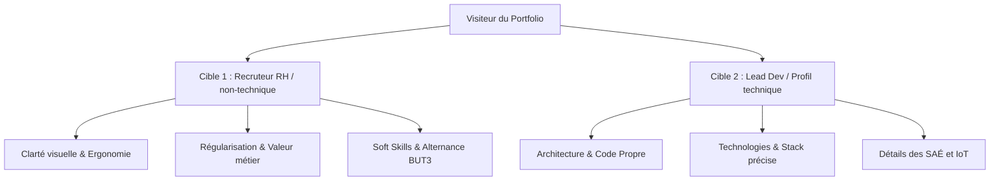

# 📝 Charte Éditoriale et Ciblage - Portfolio

Ce document définit la ligne éditoriale, le ton et le ciblage stratégique du portfolio dans le cadre de la recherche d'une **alternance pour la 3ème année de BUT MMI (Parcours Développement Web et Dispositifs Interactifs)**.

---

## 🎯 1. Objectif Majeur & Positionnement

*   **Objectif** : Décrocher un contrat d'alternance d'un an pour la 3ème année du BUT MMI (Développement Web & Dispositifs Interactifs).
*   **Ton** : **Professionnel, structuré, passionné et accessible.**
    *   *Professionnel* : Rigueur, vocabulaire adéquat, pas de jargon excessif non vulgarisé.
    *   *Passionné* : Montrer un intérêt sincère pour les technologies du web, l'IoT, le creative coding et l'expérience utilisateur.
    *   *Accessible* : Expliquer clairement l'intérêt métier et les problématiques résolues par chaque projet.

---

## 👥 2. Les Deux Cibles Stratégiques

Pour maximiser les chances de succès, le portfolio doit s'adresser à **deux profils radicalement différents** qui interviennent dans le processus de recrutement.

### 👩‍💼 Cible 1 : Le Recruteur RH / Non-Technique (Chargé de recrutement, Responsable RH)
*   **Leur profil** : Ils ne savent pas coder. Ils évaluent la posture professionnelle, la clarté de la communication, la cohérence du parcours et l'adéquation globale avec la culture d'entreprise.
*   **Leurs attentes** :
    *   Comprendre immédiatement ce que tu cherches (alternance BUT3, rythme, date de début).
    *   Trouver rapidement tes coordonnées (Email, Téléphone, LinkedIn) et ton CV en 1 clic.
    *   Voir des projets visuels finis, esthétiques et professionnels (pas de "chantiers").
    *   Comprendre l'utilité des projets (ex: *"Ce site a permis de gérer les réservations de..."* au lieu de *"J'ai fait un CRUD en PHP/SQL"*).
*   **Solutions UX & Contenu** :
    *   Une **Hero section** limpide et percutante (objectif alternance BUT3 visible instantanément).
    *   Des **fiches projets** vulgarisées avec une structure simple : **Contexte / Problème / Solution / Résultat**.
    *   Des **Soft Skills** mis en avant (autonomie, travail en équipe sur les SAÉ, force de proposition).

### 👨‍💻 Cible 2 : Le Profil Technique (Lead Developer, CTO, Développeur Senior)
*   **Leur profil** : Ce sont eux qui valideront tes compétences techniques. Ils connaissent parfaitement les langages, frameworks et bonnes pratiques de développement.
*   **Leurs attentes** :
    *   Savoir si tu écris du code propre, moderne et structuré.
    *   Vérifier tes connaissances en Git et ton niveau d'autonomie technique.
    *   Évaluer ton esprit logique, ta curiosité et ta capacité à monter en compétences sur des technologies complexes (frameworks JS/TS, intégration d'API, dispositifs interactifs/IoT).
    *   Comprendre ton rôle exact dans les projets de groupe (SAÉ MMI).
*   **Solutions UX & Contenu** :
    *   Liens directs vers des **dépôts GitHub** propres pour chaque projet, avec un `README.md` soigné.
    *   Une section **Stack Technique** détaillée (ex: Next.js, React, Node.js, TailwindCSS, SCSS) avec des badges clairs.
    *   Une explication des **choix d'implémentation** et d'architecture dans les pages de détails de projets.
    *   Des fonctionnalités interactives sophistiquées sur le portfolio lui-même pour démontrer ton savoir-faire (micro-animations fluides, Easter Egg avec un mini-terminal, schéma IoT interactif).

---

## ✍️ 3. L'Argumentaire & Phrases d'Accroche (Hero Section)

Voici 3 propositions d'accroches adaptées qui parlent simultanément aux deux cibles :

### Option A : L'Équilibre Idéal (Recommandé)
> **Titre principal** : Développeur Web & Concepteur d'Interfaces Interactives
> **Sous-titre** : Actuellement en BUT MMI, je conçois des applications web performantes et des dispositifs connectés innovants. À la recherche d'une **alternance de 3ème année** à partir de [Mois/Année] pour concrétiser vos projets de bout en bout.

*   *Pourquoi ça marche pour le RH ?* Les termes "applications performantes", "recherche d'alternance de 3ème année" et "date" sont directs, professionnels et clairs.
*   *Pourquoi ça marche pour le Dev ?* Les notions de "concepteur d'interfaces", "performantes" et "dispositifs connectés" (IoT/interactivité) éveillent la curiosité technique.

### Option B : Le Focus Technique & Créativité MMI
> **Titre principal** : Allier la rigueur du code à l'interactivité du web
> **Sous-titre** : Étudiant en BUT MMI (Développement Web & IoT), je construis des expériences numériques fluides, du responsive design aux architectures modernes. Disponible pour une **alternance d'un an** (BUT3) en tant que Développeur Front-End / Full-Stack.

*   *Pourquoi ça marche pour le RH ?* Le positionnement clair sur le poste ("Développeur Front-End / Full-Stack") et la durée du contrat ("alternance d'un an").
*   *Pourquoi ça marche pour le Dev ?* Mention de la dualité "rigueur du code / interactivité", du "responsive design" et des "architectures modernes".

### Option C : L'Approche Orientée Solutions (Product-Minded)
> **Titre principal** : De l'idée à la production : je développe vos solutions web
> **Sous-titre** : Futur alternant BUT3 (MMI Développeur Web), je traduis des maquettes complexes en interfaces vivantes et optimisées. Donnons vie ensemble à vos projets web et interactifs dès [Mois].

*   *Pourquoi ça marche pour le RH ?* Orienté résultat ("De l'idée à la production", "Développeur Web").
*   *Pourquoi ça marche pour le Dev ?* "Traduis des maquettes complexes en interfaces vivantes et optimisées", ce qui montre un respect du travail UI/UX et un souci constant d'optimisation (SEO, performances, accessibilité).

---

## 🛠️ 4. Guide d'implémentation du double ciblage dans les fiches projets

Pour chaque projet présenté, la structure doit respecter ce double parcours de lecture :

| Zone de la Fiche Projet | Destinée à... | Contenu à rédiger |
| :--- | :--- | :--- |
| **En-tête & Visuel** | Recruteur RH | Une image accrocheuse, le nom du projet, son rôle (ex: "Développeur Lead") et la problématique vulgarisée en une phrase. |
| **Objectif Métier / Rôle** | Recruteur RH & Dev | Pourquoi ce projet a été créé et quels ont été les retours. Met en valeur les Soft Skills et la gestion de projet. |
| **Stack & Badges** | Développeur Senior | Les technologies clés utilisées avec des badges visuels clairs (ex: React, Vite, Node.js, Express, MongoDB, Arduino). |
| **Défis Techniques & Choix** | Développeur Senior | Un ou deux paragraphes expliquant un problème technique résolu (ex: gestion des WebSockets pour l'IoT, optimisation du chargement des images, architecture MVC, etc.). |
| **Boutons d'Action (CTAs)** | Les deux | **[ Démo en ligne ]** (pour le RH qui veut tester visuellement) et **[ Code Source / GitHub ]** (pour le Dev qui veut lire le code). |

---

> [!NOTE]
> Cette charte est validée et sert de fil conducteur pour toute la rédaction des textes (Hero, À Propos, Projets) et l'agencement UX du portfolio.
