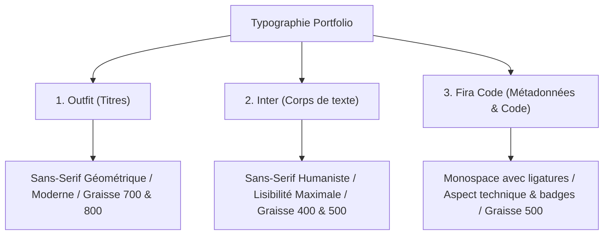

# 🎨 Charte Graphique et Spécifications Visuelles (Design System)

Ce document définit l'identité graphique premium du portfolio professionnel de **Maxence Coste**, étudiant en **BUT MMI (Parcours Développement Web & Dispositifs Interactifs)**. Il sert de source de vérité unique pour la création du design system et de la feuille de style globale (`index.css`).

---

## 🎨 1. Palette de Couleurs & Thèmes

Pour refléter la double compétence technique et créative de Maxence, l'identité visuelle repose sur un **mode sombre natif et abyssal**, avec des accents colorés vibrants. Un **mode clair** est également intégré pour l'accessibilité globale et le confort de lecture de tous les recruteurs.

### 🌗 Mode Sombre (Natif, Premium & Technologique)

Idéal pour les développeurs, il réduit la fatigue visuelle, donne une impression de profondeur spatiale et fait ressortir les micro-animations lumineuses.

| Rôle Visuel            | Variable CSS         | Code Hex                    | Code HSL                    | Rendu Visuel                     |
| :--------------------- | :------------------- | :-------------------------- | :-------------------------- | :------------------------------- |
| **Fond Principal**     | `--bg-primary`       | `#0B0F19`                   | `hsl(224, 40%, 7%)`         | Abyssal (Bleu-Noir profond)      |
| **Fond Secondaire**    | `--bg-secondary`     | `#111827`                   | `hsl(222, 47%, 11%)`        | Écrans et grandes sections       |
| **Cartes & Surfaces**  | `--surface`          | `#161E2E`                   | `hsl(220, 39%, 13%)`        | Bento Grid et conteneurs         |
| **Accent Primaire**    | `--accent-primary`   | `#6366F1`                   | `hsl(239, 84%, 67%)`        | Indigo (Logique, Code, Liens)    |
| **Accent Secondaire**  | `--accent-secondary` | `#10B981`                   | `hsl(161, 84%, 43%)`        | Vert Menthe (IoT, Disponibilité) |
| **Texte Principal**    | `--text-primary`     | `#F9FAFB`                   | `hsl(0, 0%, 98%)`           | Blanc cassé (Très lisible)       |
| **Texte Secondaire**   | `--text-secondary`   | `#9CA3AF`                   | `hsl(220, 9%, 76%)`         | Gris neutre (Descriptions)       |
| **Texte Mute**         | `--text-muted`       | `#6B7280`                   | `hsl(220, 9%, 46%)`         | Gris sombre (Sous-titres, dates) |
| **Bordures / Lignes**  | `--border-color`     | `rgba(255, 255, 255, 0.08)` | `hsla(0, 0%, 100%, 0.08)`   | Lignes fines technologiques      |
| **Effet Halo / Lueur** | `--glow-color`       | `rgba(99, 102, 241, 0.15)`  | `hsla(239, 84%, 67%, 0.15)` | Halos de lumière / Glow          |

### ☀️ Mode Clair (Confort, Accessibilité & Rigueur)

Un mode clair épuré s'appuyant sur une structure minimaliste et des contrastes optimisés.

| Rôle Visuel            | Variable CSS         | Code Hex                  | Code HSL                    | Rendu Visuel                         |
| :--------------------- | :------------------- | :------------------------ | :-------------------------- | :----------------------------------- |
| **Fond Principal**     | `--bg-primary`       | `#F9FAFB`                 | `hsl(210, 40%, 98%)`        | Blanc-Gris clair                     |
| **Fond Secondaire**    | `--bg-secondary`     | `#F3F4F6`                 | `hsl(220, 14%, 96%)`        | Structure et arrières-plans          |
| **Cartes & Surfaces**  | `--surface`          | `#FFFFFF`                 | `hsl(0, 0%, 100%)`          | Blanc pur                            |
| **Accent Primaire**    | `--accent-primary`   | `#4F46E5`                 | `hsl(243, 75%, 59%)`        | Indigo soutenu (Contraste suffisant) |
| **Accent Secondaire**  | `--accent-secondary` | `#059669`                 | `hsl(162, 93%, 30%)`        | Vert Menthe sombre (Contraste)       |
| **Texte Principal**    | `--text-primary`     | `#111827`                 | `hsl(221, 39%, 11%)`        | Bleu-Noir profond (Contraste AA)     |
| **Texte Secondaire**   | `--text-secondary`   | `#4B5563`                 | `hsl(215, 16%, 37%)`        | Gris ardoise (Lecture continue)      |
| **Texte Mute**         | `--text-muted`       | `#9CA3AF`                 | `hsl(218, 11%, 65%)`        | Gris clair (Méta-données)            |
| **Bordures / Lignes**  | `--border-color`     | `rgba(0, 0, 0, 0.08)`     | `hsla(0, 0%, 0%, 0.08)`     | Lignes grises fines                  |
| **Effet Halo / Lueur** | `--glow-color`       | `rgba(79, 70, 229, 0.08)` | `hsla(243, 75%, 59%, 0.08)` | Halos de lumière discrets            |

---

## 🔤 2. Typographie

L'identité typographique croise la modernité esthétique du design et la rigueur du développement informatique. Les polices sont importées directement depuis **Google Fonts**.

### Les Trois Polices de Caractères



1. **Outfit** (Sans-Serif) :
   - **Rôle** : Titres de sections, grands slogans (H1, H2, H3).
   - **Style** : Géométrique, large, ronde et élégante. Donne immédiatement l'effet "Wow" recherché par les graphistes et designers.
   - **Import** : `Outfit:wght@400;500;700;800`

2. **Inter** (Sans-Serif) :
   - **Rôle** : Corps de texte, paragraphes, descriptions des projets phares, boutons de formulaires.
   - **Style** : Conçue spécialement pour les écrans d'ordinateurs et mobiles. Lisibilité impeccable même en petite taille.
   - **Import** : `Inter:wght@400;500;600`

3. **Fira Code** (Monospace) :
   - **Rôle** : Tags technologiques (Badges), statistiques clés, labels d'interfaces, morceaux de codes et le mini-terminal interactif.
   - **Style** : Une police à espacement fixe avec ligatures de programmation, rappelant immédiatement l'environnement de développement.
   - **Import** : `Fira+Code:wght@400;500`

---

### 📏 Échelle Typographique (Responsive CSS)

L'échelle typographique s'ajuste dynamiquement en fonction de la taille de l'écran pour garantir une lisibilité optimale sur mobile (Mobile-First).

| Niveau HTML | Utilisation                  | Taille (Desktop)   | Taille (Mobile)    | Graisse (Weight)   | Police    |
| :---------- | :--------------------------- | :----------------- | :----------------- | :----------------- | :-------- |
| `h1`        | Titre Hero / Accueil         | `3.00rem` (48px)   | `2.25rem` (36px)   | `800` (Extra Bold) | Outfit    |
| `h2`        | Titre de Section             | `2.00rem` (32px)   | `1.65rem` (26px)   | `700` (Bold)       | Outfit    |
| `h3`        | Titre de Carte / Carte Bento | `1.50rem` (24px)   | `1.25rem` (20px)   | `700` (Bold)       | Outfit    |
| `h4`        | Sous-titre interne           | `1.20rem` (19px)   | `1.10rem` (17.5px) | `500` (Medium)     | Outfit    |
| `body`      | Paragraphes de lecture       | `1.00rem` (16px)   | `0.95rem` (15px)   | `400` (Regular)    | Inter     |
| `small`     | Légendes, dates, métadonnées | `0.85rem` (13.5px) | `0.80rem` (12.8px) | `400` (Regular)    | Inter     |
| `code`      | Badges techniques, Terminal  | `0.90rem` (14.5px) | `0.85rem` (13.5px) | `500` (Medium)     | Fira Code |

---

## 🧱 3. Jetons de Design System (Spacing & UI Rules)

Ces règles structurelles créent la cohérence visuelle sur l'ensemble du site.

### 📐 Angles & Arrondis (`border-radius`)

- **Small (`--radius-sm` : `4px`)** : Pour les petits éléments rigides (Tech Badges, curseur personnalisé, séparateurs).
- **Medium (`--radius-md` : `12px`)** : Pour les éléments interactifs cliquables de taille moyenne (Boutons, champs de formulaires, infobulles).
- **Large (`--radius-lg` : `24px`)** : Pour les grands blocs structurels (Cartes de projets Bento, conteneurs, modales de détails).

### 🌌 Effet "Liquid Glass" (Glassmorphism Premium)

Pour donner du relief sur fond sombre, les cartes Bento et la barre de navigation Navbar intègrent le style suivant :

```css
.liquid-glass {
  background: var(--surface-translucent, rgba(22, 30, 46, 0.7));
  backdrop-filter: blur(12px) saturate(180%);
  -webkit-backdrop-filter: blur(12px) saturate(180%);
  border: 1px solid var(--border-color);
  box-shadow: 0 8px 32px 0 rgba(0, 0, 0, 0.3);
}
```

### ⚡ Espacements standardisés (Spacing Scale)

- `--space-xs` : `0.5rem` (8px) - Espacement interne de badge.
- `--space-sm` : `1rem` (16px) - Marges internes de formulaire.
- `--space-md` : `2.0rem` (32px) - Padding standard des cartes projets.
- `--space-lg` : `4.0rem` (64px) - Marges entre les sections principales.

---

## ♿ 4. Directives d'Accessibilité (WCAG 2.1 AA)

Afin d'assurer que le portfolio est navigable et agréable pour tous les recruteurs (y compris ceux souffrant de déficience visuelle ou de daltonisme), les règles suivantes de contraste et d'ergonomie sont **strictement appliquées** :

1. **Rapports de Contraste** :
   - Toutes les paires texte/arrière-plan affichent un rapport de contraste supérieur à **4.5:1** pour le texte courant et **3:1** pour le texte large (supérieur à 18pt/24px).
   - **Mode Sombre** : Texte blanc cassé (`#F9FAFB`) sur fond sombre (`#0B0F19`) = contraste de **17.5:1** (Niveau AAA). Accent Indigo (`#6366F1`) sur fond sombre (`#0B0F19`) = ratio de **5.1:1** (Niveau AA, idéal pour les liens et bordures actives).
   - **Mode Clair** : Texte bleu-noir (`#111827`) sur fond clair (`#F9FAFB`) = contraste de **16.2:1** (Niveau AAA). Accent Indigo clair (`#4F46E5`) sur fond blanc (`#FFFFFF`) = ratio de **5.4:1** (Niveau AA).

2. **Éléments sans couleur exclusive** :
   - Les informations ne sont jamais transmises uniquement par la couleur. Par exemple, les liens soulignés au survol ou possédant des icônes explicites (ex: icône externe `↗` à côté d'un lien).
   - Les formulaires intègrent des labels textuels visibles (`<label>`) en plus des placeholders.

3. **Gabarit Focus de Navigation Clavier** :
   - Tous les éléments interactifs (`a`, `button`, `input`, `textarea`) intègrent une règle `:focus-visible` spécifique :
     ```css
     *:focus-visible {
       outline: 2px solid var(--accent-primary);
       outline-offset: 4px;
     }
     ```

---

## 💻 5. Exemple de Déclaration CSS Globale

Voici l'ossature CSS qui sera importée dans la phase **[TECH-03]** :

```css
/* Imports Google Fonts */
@import url('https://fonts.googleapis.com/css2?family=Fira+Code:wght@400;500&family=Inter:wght@400;500;600&family=Outfit:wght@400;500;700;800&display=swap');

:root {
  /* Échelle d'arrondis */
  --radius-sm: 4px;
  --radius-md: 12px;
  --radius-lg: 24px;

  /* Espacements */
  --space-xs: 0.5rem;
  --space-sm: 1rem;
  --space-md: 2rem;
  --space-lg: 4rem;

  /* Typographie - Font Families */
  --font-titles: 'Outfit', sans-serif;
  --font-body: 'Inter', sans-serif;
  --font-code: 'Fira Code', monospace;

  /* Thème Sombre par Défaut */
  --bg-primary: #0b0f19;
  --bg-secondary: #111827;
  --surface: #161e2e;
  --surface-translucent: rgba(22, 30, 46, 0.7);
  --accent-primary: #6366f1;
  --accent-secondary: #10b981;
  --text-primary: #f9fafb;
  --text-secondary: #9ca3af;
  --text-muted: #6b7280;
  --border-color: rgba(255, 255, 255, 0.08);
  --glow-color: rgba(99, 102, 241, 0.15);
}

/* Commutation en Thème Clair */
[data-theme='light'] {
  --bg-primary: #f9fafb;
  --bg-secondary: #f3f4f6;
  --surface: #ffffff;
  --surface-translucent: rgba(255, 255, 255, 0.7);
  --accent-primary: #4f46e5;
  --accent-secondary: #059669;
  --text-primary: #111827;
  --text-secondary: #4b5563;
  --text-muted: #9ca3af;
  --border-color: rgba(0, 0, 0, 0.08);
  --glow-color: rgba(79, 70, 229, 0.08);
}
```

---

_Ce document de Charte Graphique est finalisé et validé. Il guidera l'intégration stylistique de toutes les pages et de tous les composants._
