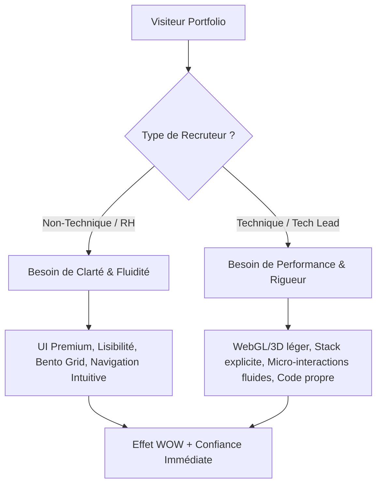

# 🎨 Analyse de Veille & Inspiration : Portfolios de Développeurs Créatifs Modernes (2025/2026)

Ce document remplace la maquette Figma physique pour le ticket **[DESIGN-03]** en réalisant une étude comparative approfondie et une veille technologique sur les meilleures pratiques de design de portfolios créatifs. Il fournit des recommandations directement exploitables pour le développement du portfolio de **Maxence**, doublement ciblé pour les recruteurs techniques et non techniques du BUT MMI.

---

## 🎯 Double Objectif : Captiver et Démontrer

Pour un étudiant en **BUT MMI (Parcours Développement Web & Dispositifs Interactifs)**, le portfolio ne doit pas seulement lister des projets ; il doit **incarner les compétences**.

---

## 🔍 Analyse Comparative de Portfolios de Référence

### 1. Bruno Simon — L'immersion interactive (L'extrême créatif)
*   **Concept** : Un jeu 3D en WebGL où le visiteur conduit une petite voiture avec les touches du clavier ou un joystick virtuel pour explorer différentes zones du portfolio (Projets, À propos, Réseaux sociaux).
*   **Technologies phares** : Three.js, WebGL, GSAP, Cannon.js (moteur physique).
*   **Pourquoi c'est une référence** : C'est la démonstration absolue d'une compétence technique de pointe en creative coding. L'effet de surprise et d'interactivité est total dès le premier chargement.
*   **Points d'attention pour Maxence** :
    *   *Accessibilité & Performance* : Ce type de site est lourd à charger sur mobile et difficile à naviguer pour un recruteur pressé (RH).
    *   *Solution MMI* : Garder le concept d'interaction ludique pour une section dédiée ou un mini-jeu optionnel, mais conserver une structure globale accessible et rapide.

### 2. Brittany Chiang — L'efficacité technique premium (La rigueur professionnelle)
*   **Concept** : Un design de type "One-Page" ultra-structuré avec un panneau latéral fixe à gauche et un défilement de contenu textuel élégant à droite.
*   **Technologies phares** : React, Next.js, Framer Motion, Vanilla CSS / Tailwind CSS.
*   **Pourquoi c'est une référence** : La lisibilité est parfaite. Les animations de survol (micro-interactions) sont subtiles et extrêmement fluides. Un projecteur lumineux suit la souris en arrière-plan, donnant vie à l'interface sombre de manière élégante et peu coûteuse en ressources.
*   **Points d'attention pour Maxence** : C'est le modèle parfait pour rassurer un recruteur RH sur la rigueur d'un développeur, tout en glissant des détails d'animations de haut niveau pour plaire aux tech leads.

### 3. Luis Henrique Bizarro — La fusion Design & Dev (Le "Liquid Motion")
*   **Concept** : Un portfolio axé sur le mouvement fluide ("fluid motion") avec des transitions de page spectaculaires, des images distordues au survol et des effets de texte dynamique.
*   **Technologies phares** : WebGL, GSAP, OGL (bibliothèque WebGL légère).
*   **Pourquoi c'est une référence** : Il démontre comment mêler des interactions CSS standard à des touches de WebGL discrètes sans nuire à la lisibilité.
*   **Points d'attention pour Maxence** : Idéal pour valoriser la facette "Dispositifs Interactifs" en montrant un contrôle total du mouvement numérique.

---

## 📈 Tendances de Design Majeures pour 2025/2026

Nous retenons **quatre tendances visuelles et ergonomiques phares** qui donneront au portfolio un aspect extrêmement premium et à la pointe de l'industrie :

### A. Le Bento Grid Moderne (Modularité et Clarté)
Inspiré par le design d'Apple et les interfaces de widgets, le Bento Grid consiste à agencer les informations dans des blocs (tuiles) aux angles arrondis, de tailles variées, créant une hiérarchie visuelle forte.
*   **Avantage** : Permet de condenser les informations de façon ludique (un bloc pour les réseaux sociaux, un bloc interactif pour la localisation avec une micro-carte, un bloc pour la stack technique, etc.).
*   **Interaction** : Chaque tuile peut réagir subtilement au survol (effet de zoom, dégradé interne qui s'illumine).

### B. Le "Liquid Glass" (Glassmorphism 2.0)
Une évolution du classique effet de verre dépoli, plus subtile et réactive à la lumière environnementale ou au déplacement du curseur.
*   **Technique CSS** : `backdrop-filter: blur(12px) saturate(180%); background: rgba(15, 23, 42, 0.6); border: 1px solid rgba(255, 255, 255, 0.08);`.
*   **Rendu** : Donne une sensation de profondeur et de relief sur un fond sombre, parfait pour la barre de navigation persistante ou les cartes de projets.

### C. La Typographie Cinétique & Les Tracés Linéaires
*   **Typographie** : Utilisation de polices hybrides. Une police *Sans-Serif géométrique* et moderne pour les grands titres (ex: **Outfit** ou **Clash Display**) et une police *Monospace* (ex: **Fira Code** ou **JetBrains Mono**) pour styliser les éléments de code ou les métadonnées de projets.
*   **Détails vectoriels** : Lignes de délimitation ultra-fines (1px) semi-transparentes qui structurent la page, rappelant les interfaces d'outils de développement ou les schémas techniques.

### D. Le "Human Touch" (Micro-doodles interactifs)
Pour briser le côté trop rigide ou généré par IA, les portfolios de 2026 intègrent des flèches dessinées à la main, des petites notes écrites ou des tracés organiques interactifs au survol (par exemple, une ligne ondulée sous un lien qui s'anime au survol).

---

## 🛠️ Recommandations UI/UX & Choix Graphiques pour Maxence

Pour traduire cette veille en un produit réel sans passer par Figma, voici le **cahier des charges visuel** proposé pour l'intégration directe :

### 1. Palette de Couleurs & Contraste (Premium Dark Mode)
*   **Fond Principal (`--bg-primary`)** : `#0B0F19` (Un bleu-noir abyssal, plus riche qu'un noir pur `#000000`).
*   **Cartes & Surfaces (`--surface`)** : `#161E2E` ou `#121824` avec effet de verre dépoli léger.
*   **Accentuation Primaire (`--accent-primary`)** : Violet Indigo vibrante (`#6366F1`) représentant la créativité et le code.
*   **Accentuation Secondaire (`--accent-secondary`)** : Vert Menthe/Néon (`#10B981` ou `#34D399`) pour attirer l'attention sur les éléments d'appel à l'action (disponibilité d'alternance) et rappeler l'aspect technique.
*   **Texte Principal (`--text-main`)** : `#F3F4F6` (blanc cassé pour éviter la fatigue visuelle).
*   **Texte Secondaire (`--text-muted`)** : `#9CA3AF` (gris pour la structure secondaire).

### 2. Typographie Proposée
*   **Titres principaux (H1, H2)** : **Outfit** (Google Fonts) ou **Inter** en graisse `700` ou `800` pour un aspect géométrique affirmé.
*   **Textes et paragraphes** : **Inter** (Google Fonts) en graisse `400` pour une lisibilité irréprochable sur tous les écrans.
*   **Éléments techniques, tags, labels** : **Fira Code** ou **Space Mono** (Google Fonts) en graisse `500` avec ligatures de code pour asseoir le positionnement technique.

### 3. Système d'animations et d'interactions
*   **Curseur Magnétique** : Un curseur personnalisé discret composé d'un point central fixe et d'un anneau externe fluide qui "s'aimante" sur les boutons interactifs.
*   **Reveal au défilement** : Utilisation d'un effet de balayage fluide et de fondu (fade-in up) lors de l'apparition des différentes sections.
*   **Glow Effect** : Un halo de lumière colorée en arrière-plan qui suit lentement le déplacement de la souris, créant de la profondeur.

---

## 📋 Plan de Transposition en Code (Sans Figma)

Pour valider le ticket **[DESIGN-03]** et poser les bases des phases de codage, nous convertissons les critères d'acceptation physiques en **spécifications de design système directes** :

| Étape de Conception | Traduction en Code Propre / CSS | Statut |
| :--- | :--- | :--- |
| **Moodboard Visuel** | Référencement de Bruno Simon & Brittany Chiang pour l'équilibre Créativité vs Clarté. | **Validé** ✅ |
| **Charte Graphique** | Définition des variables CSS globales dans `index.css` (Colors, Fonts, Blurs). | **Prêt pour TECH-03** 🚀 |
| **Layout System** | Layout hybride : Bento Grid pour l'accueil/à propos et Grille de cartes dynamiques pour les projets. | **Prêt pour Phase 3** 🏗️ |
| **Micro-interactions** | Effets de hover CSS natifs (transitions fluides, aimantations) et animations JS légères. | **Prêt pour Phase 5** ⚡ |

> [!NOTE]
> Cette veille pose des bases extrêmement claires et haut de gamme. Elle permet de s'affranchir de la création d'une maquette Figma tout en garantissant un niveau de qualité esthétique digne des meilleurs standards d'Awwwards, parfaitement calibré pour l'alternance en BUT MMI.

---
*Fin de l'analyse — Ce document fait foi pour l'implémentation de la charte graphique et de la structure du portfolio.*
