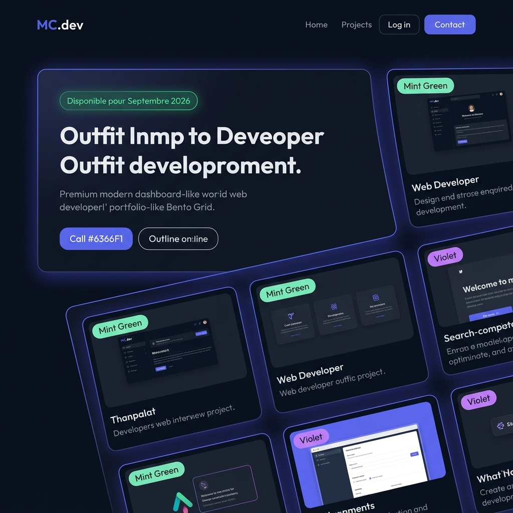
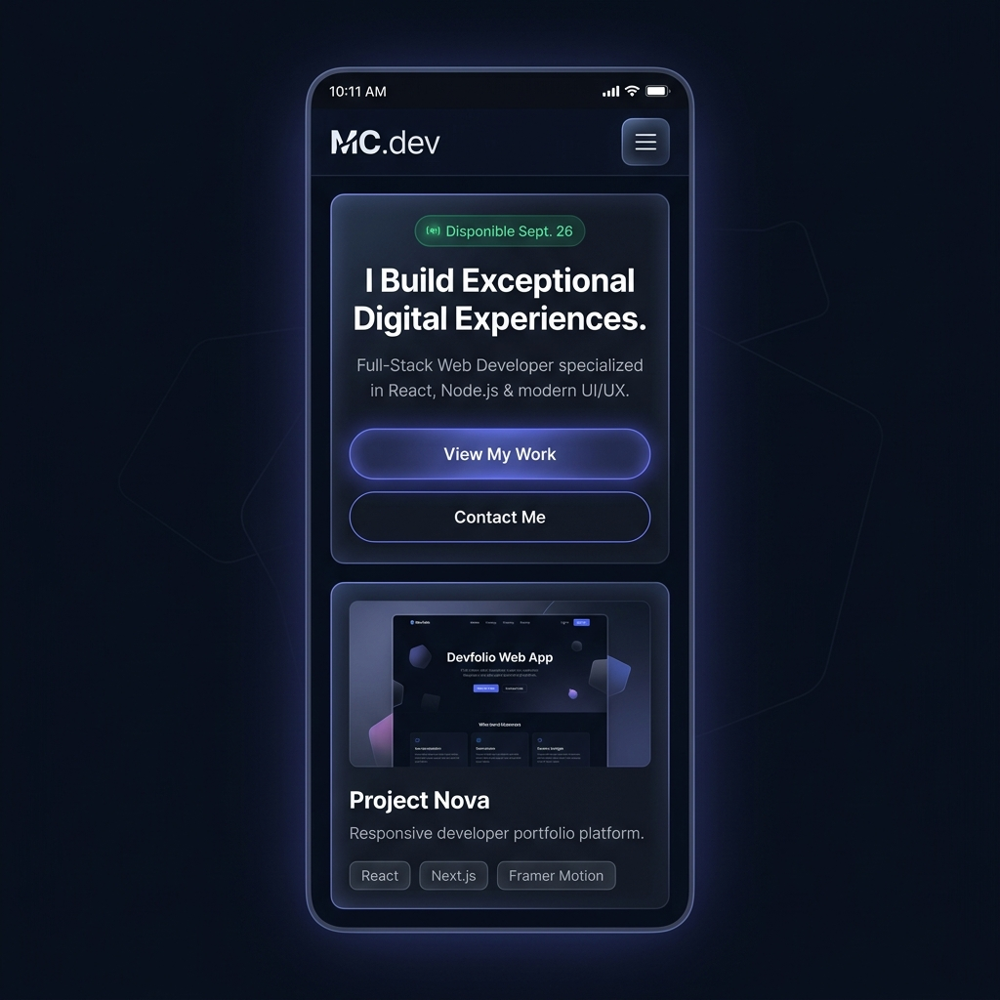

# 🎨 Maquettes Haute Fidélité (Hi-Fi) et Spécifications Visuelles Pixel-Perfect

Ce document présente les **maquettes haute fidélité (Hi-Fi)** et les spécifications techniques d'intégration visuelle pour le portfolio professionnel de **Maxence Coste** (BUT MMI - Parcours Développement Web & Dispositifs Interactifs). 

Il remplace le besoin de maquettes Figma physiques par une spécification pixel-perfect directement exploitable par l'intégrateur web, décrivant les espacements, les variables CSS, les ombres, les états interactifs et les transitions.

---

## 🖼️ 1. Aperçu des Maquettes Haute Fidélité (Hi-Fi)

Les maquettes ci-dessous ont été générées pour représenter fidèlement l'esthétique premium du portfolio (mode sombre abyssal, composants de type bento grid, effet glassmorphism, et accents lumineux violet/indigo et vert menthe).

### 🖥️ 1.1 Maquette Version Bureau (Desktop - Écran >= 1024px)
La disposition tire parti de la largeur de l'écran pour agencer une **Bento Grid** dynamique où les informations clés (Hero, Disponibilité, Projets phares, IoT, CLI Terminal) sont visibles d'un seul coup d'œil.



### 📱 1.2 Maquette Version Mobile (Écran < 768px)
La disposition s'adapte dans une approche **Mobile-First** rigoureuse, en empilant verticalement les cartes Bento de manière harmonieuse avec une zone de confort de clic optimisée pour les pouces.



---

## 📐 2. Spécifications de la Bento Grid (Layout Desktop)

La structure de la page d'accueil utilise le modèle d'agencement **CSS Grid** pour créer une grille asymétrique et harmonieuse (type Bento Grid).

### Structure de la Grille Principale
*   **Conteneur global** : Max-width de `1200px`, centré horizontalement, padding latéral de `2rem`.
*   **Propriétés CSS** :
    ```css
    .bento-grid {
      display: grid;
      grid-template-columns: repeat(12, 1fr);
      grid-gap: 1.5rem; /* 24px */
      grid-auto-rows: minmax(180px, auto);
    }
    ```

### Cartographie des Zones (12 colonnes)

```mermaid
grid-layout
  col-span-8: "Carte Hero (Accueil - Intro + CTA) [grid-column: span 8 / grid-row: span 2]"
  col-span-4: "Carte Statut & Profil (Vert pulsant + Avatar) [grid-column: span 4 / grid-row: span 2]"
  col-span-4: "Carte Compétences Core [grid-column: span 4]"
  col-span-8: "Mini Terminal CLI Interactif (Easter Egg) [grid-column: span 8 / grid-row: span 2]"
  col-span-4: "Carte Dispositif Connecté IoT [grid-column: span 4]"
```

*   **Carte Hero (Intro + CTA)** : `grid-column: span 8; grid-row: span 2;`
*   **Carte Statut & Profil (Vert pulsant + Photo)** : `grid-column: span 4; grid-row: span 2;`
*   **Carte Compétences Core (DA & Tech)** : `grid-column: span 4; grid-row: span 2;`
*   **Mini Terminal CLI Interactif** : `grid-column: span 8; grid-row: span 2;`
*   **Carte Focus IoT / Dispositifs Interactifs** : `grid-column: span 4; grid-row: span 2;`

---

## 🧱 3. Composants Core : Spécifications Pixel-Perfect & CSS

Tous les composants utilisent le concept **Liquid Glass** défini dans la [Charte Graphique](file:///C:/Users/maxen/Documents/portfolio/design/charte_graphique.md).

### 3.1 Barre de Navigation (Navbar)
*   **Hauteur fixe** : `70px`.
*   **Style CSS** :
    ```css
    .navbar {
      position: fixed;
      top: 0;
      left: 0;
      width: 100%;
      height: 70px;
      z-index: 1000;
      background: rgba(11, 15, 25, 0.75); /* --bg-primary translucide */
      backdrop-filter: blur(12px) saturate(180%);
      -webkit-backdrop-filter: blur(12px) saturate(180%);
      border-bottom: 1px solid rgba(255, 255, 255, 0.08); /* --border-color */
      display: flex;
      justify-content: space-between;
      align-items: center;
      padding: 0 4.0rem;
      transition: all 0.3s cubic-bezier(0.16, 1, 0.3, 1);
    }
    ```

*   **Comportement actif au défilement (Scroll down)** :
    Dès que la page descend de plus de `50px`, la Navbar s'affine et son ombre s'intensifie pour libérer de l'espace de lecture :
    ```css
    .navbar.scrolled {
      height: 60px;
      background: rgba(11, 15, 25, 0.90);
      box-shadow: 0 10px 30px -10px rgba(0, 0, 0, 0.5);
    }
    ```

---

### 3.2 Cartes Bento & Surfaces (`.bento-card`)
*   **Style CSS de base** :
    ```css
    .bento-card {
      background: var(--surface-translucent, rgba(22, 30, 46, 0.7));
      border: 1px solid var(--border-color, rgba(255, 255, 255, 0.08));
      border-radius: var(--radius-lg, 24px);
      padding: var(--space-md, 2.0rem);
      box-shadow: 0 8px 32px 0 rgba(0, 0, 0, 0.25);
      position: relative;
      overflow: hidden;
      display: flex;
      flex-direction: column;
      justify-content: space-between;
      transition: transform 0.4s cubic-bezier(0.16, 1, 0.3, 1),
                  border-color 0.3s ease,
                  box-shadow 0.4s cubic-bezier(0.16, 1, 0.3, 1);
    }
    ```

*   **Effet Halo de Glow Intérieur (Radial Gradient Overlay)** :
    Chaque carte possède un calque d'arrière-plan discret qui simule un spot lumineux suivant l'emplacement du curseur (ou centré par défaut) :
    ```css
    .bento-card::before {
      content: '';
      position: absolute;
      top: 0;
      left: 0;
      right: 0;
      bottom: 0;
      background: radial-gradient(800px circle at var(--x, 50%) var(--y, 50%), 
                                  rgba(99, 102, 241, 0.06), 
                                  transparent 40%);
      z-index: 1;
      pointer-events: none;
      transition: opacity 0.5s ease;
    }
    ```

---

### 3.3 Boutons & Call-to-Action (CTA)

```text
CTA Primaire (Indigo & Glow)                CTA Secondaire (Outline & Clean)
+-------------------------------+           +-------------------------------+
|       [ Voir mes projets ]    |           |     [ Télécharger le CV ]     |
+-------------------------------+           +-------------------------------+
- Background: #6366F1                      - Background: transparent
- Border: none                              - Border: 1px solid #9CA3AF (gris)
- Text: #F9FAFB                             - Text: #9CA3AF
- Shadow: 0 4px 14px rgba(99,102,241,0.4)    - Hover: Border #F9FAFB, Text #F9FAFB
```

*   **Bouton Primaire (`.btn-primary`)** :
    ```css
    .btn-primary {
      background: var(--accent-primary, #6366F1);
      color: var(--text-primary, #F9FAFB);
      font-family: var(--font-body, 'Inter', sans-serif);
      font-weight: 600;
      font-size: 1.0rem;
      padding: 0.8rem 1.6rem;
      border-radius: var(--radius-md, 12px);
      border: none;
      cursor: pointer;
      box-shadow: 0 4px 14px 0 rgba(99, 102, 241, 0.4);
      display: inline-flex;
      align-items: center;
      gap: 0.5rem;
      transition: all 0.3s cubic-bezier(0.16, 1, 0.3, 1);
    }
    ```

*   **Bouton Secondaire (`.btn-secondary`)** :
    ```css
    .btn-secondary {
      background: transparent;
      color: var(--text-secondary, #9CA3AF);
      font-family: var(--font-body, 'Inter', sans-serif);
      font-weight: 500;
      font-size: 1.0rem;
      padding: 0.8rem 1.6rem;
      border-radius: var(--radius-md, 12px);
      border: 1px solid var(--text-muted, #6B7280);
      cursor: pointer;
      display: inline-flex;
      align-items: center;
      gap: 0.5rem;
      transition: all 0.3s cubic-bezier(0.16, 1, 0.3, 1);
    }
    ```

---

### 3.4 Mini Terminal de commande interactif (`.cli-terminal`)
L'effet rétro et rigoureux repose sur des contrastes marqués, des bordures affirmées et une police Monospace à ligatures.

*   **Style CSS** :
    ```css
    .cli-terminal {
      background: #060913; /* Plus sombre que le fond général */
      border: 1px solid rgba(99, 102, 241, 0.2); /* Liseré indigo discret */
      border-radius: 12px;
      font-family: var(--font-code, 'Fira Code', monospace);
      color: var(--accent-secondary, #10B981); /* Vert terminal */
      padding: 1.5rem;
      box-shadow: inset 0 2px 8px rgba(0, 0, 0, 0.8);
      font-size: 0.9rem;
      line-height: 1.5;
    }
    .cli-terminal .prompt {
      color: var(--accent-primary, #6366F1); /* Indigo */
    }
    .cli-terminal .cursor {
      display: inline-block;
      width: 8px;
      height: 15px;
      background: var(--accent-secondary, #10B981);
      animation: blink 1s step-end infinite;
      vertical-align: middle;
      margin-left: 4px;
    }
    ```

---

### 3.5 Dispositif Connecté IoT : Schéma Interactif (`.iot-interactive`)
Afin de valoriser la spécialité IoT (parcours BUT MMI), ce composant SVG intègre des flux lumineux animés au scroll et au survol.
*   **Style de flux neon** :
    ```css
    .iot-wire-active {
      stroke: var(--accent-secondary, #10B981);
      stroke-dasharray: 8, 8;
      animation: flow-neon 2s linear infinite;
    }
    
    @keyframes flow-neon {
      to {
        stroke-dashoffset: -20;
      }
    }
    ```

---

## ⚡ 4. États Interactifs, Transitions & Animations (Cubic-Bezier)

Pour créer une interface vivante et dynamique sans perturber le confort d'utilisation, toutes les transitions utilisent la même courbe d'accélération ergonomique (Out-Expo) et des timings optimisés.

### 4.1 La Courbe d'Animation Standard
```css
:root {
  --transition-smooth: all 0.4s cubic-bezier(0.16, 1, 0.3, 1);
}
```
*   **Avantage de `cubic-bezier(0.16, 1, 0.3, 1)`** : Démarrage extrêmement rapide puis décélération douce et fluide. Donne un effet instantané et très premium.

### 4.2 Spécification des États Interactifs

| Composant | État Normal | État :hover (Survol) | État :focus-visible (Clavier) | État :active (Clic) |
| :--- | :--- | :--- | :--- | :--- |
| **Bento Card** | `transform: scale(1)`<br>`box-shadow: 0 8px 32px rgba(0,0,0,0.25)` | `transform: translateY(-6px) scale(1.01)`<br>`border-color: rgba(99, 102, 241, 0.25)`<br>`box-shadow: 0 20px 40px -10px rgba(0,0,0,0.4), 0 0 15px rgba(99,102,241,0.1)` | Outline indigo de 2px à 4px du bord | `transform: translateY(-2px) scale(0.99)` |
| **Bouton Primaire** | `transform: scale(1)` | `transform: translateY(-3px)`<br>`box-shadow: 0 6px 20px rgba(99, 102, 241, 0.6)` | Outline indigo de 2px avec offset de 4px | `transform: translateY(0) scale(0.97)` |
| **Bouton Secondaire** | `border: 1px solid #6B7280`<br>`color: #9CA3AF` | `border-color: #F9FAFB`<br>`color: #F9FAFB`<br>`background: rgba(255,255,255,0.05)` | Outline indigo de 2px avec offset de 4px | `transform: scale(0.97)` |
| **Navbar Link** | `color: #9CA3AF` | `color: #F9FAFB`<br>`transform: scale(1.05)` | Outline indigo de 2px avec offset de 2px | `opacity: 0.8` |
| **Input Formulaire** | `border-color: rgba(255,255,255,0.08)`<br>`background: rgba(17, 24, 39, 0.5)` | `border-color: rgba(255,255,255,0.15)` | `border-color: #6366F1`<br>`box-shadow: 0 0 10px rgba(99,102,241,0.15)` | - |

---

## 🎨 5. Guide du Mode Clair Fallback (Accessibilité)

En mode clair (déclenché par la classe `[data-theme="light"]` sur l'élément `<html>`), les maquettes s'adaptent selon les règles de contraste strictes (WCAG AA).

```text
Mode Sombre Abyssal                          Mode Clair Épuré
+-------------------------------+           +-------------------------------+
|  Card Surface: #161E2E        |    --->   |  Card Surface: #FFFFFF        |
|  Border: rgba(255,255,255,0.08)|    --->   |  Border: rgba(0,0,0,0.08)     |
|  Text Primary: #F9FAFB        |    --->   |  Text Primary: #111827        |
|  Text Secondary: #9CA3AF      |    --->   |  Text Secondary: #4B5563      |
|  Accent Glow: rgba(99,102,241)|    --->   |  Accent Glow: rgba(79,70,229) |
+-------------------------------+           +-------------------------------+
```

*   **Ombres portées en mode clair** : Pour conserver le relief des cartes Bento sur fond clair (`#F9FAFB`), la boîte d'ombrage gagne en douceur et en étalement neutre :
    ```css
    [data-theme="light"] .bento-card {
      box-shadow: 0 10px 30px -5px rgba(0, 0, 0, 0.05), 
                  0 1px 3px rgba(0, 0, 0, 0.02);
    }
    [data-theme="light"] .bento-card:hover {
      box-shadow: 0 20px 45px -10px rgba(0, 0, 0, 0.08);
      border-color: rgba(79, 70, 229, 0.3);
    }
    ```
