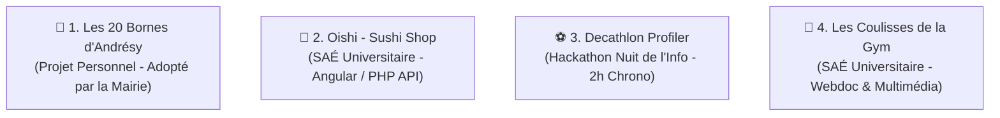

# 📁 Sélection & Structuration des Projets Phares

Ce document présente les **4 projets majeurs** sélectionnés pour le portfolio de **Maxence Coste**. Chaque projet a été restructuré et enrichi selon les principes de la **Charte Éditoriale (Double Ciblage RH & Lead Dev)** afin de séduire à la fois les recruteurs non-techniques et les profils techniques (Lead Dev / CTO) pour décrocher une **alternance BUT 3 (MMI)**.

---

## 🗺️ Vue d'ensemble des Projets



---

## 🏃 1. Les 20 Bornes d'Andrésy

### 📌 Fiche d'identité

- **Catégorie** : Projet Personnel (Adopté et mis en production par la Mairie)
- **Rôle** : Designer UI & Développeur Front-End
- **Stack Technique** : HTML5, CSS3 (Custom CSS Layer), Bootstrap 5.3, JavaScript Vanilla
- **État** : En production à l'adresse [20bornes.chez.com](http://20bornes.chez.com/) (prévu pour l'édition du 29 novembre 2026)
- **Visuels clés** :
  - Mockup PC & Mobile : [mockup_pc_mobile.png](file:///c:/Users/maxen/Documents/portfolio/assets/images/mockup_pc_mobile.png)
  - Page d'accueil : [accueil_20bornes.png](file:///c:/Users/maxen/Documents/portfolio/assets/images/accueil_20bornes.png)

---

### 👩‍💼 Le Parcours RH (Valeur Métier & Posture Professionnelle)

- **Le Contexte & Le Problème** :
  L'événement annuel des "20 Bornes d'Andrésy" est une course populaire majeure. Cependant, son portail historique était vieillissant, illisible sur mobile (non responsive), et présentait des lenteurs de chargement. Cette vitrine obsolète pénalisait les inscriptions et l'image moderne de la ville.
- **La Solution & Mon Rôle** :
  En totale autonomie, j'ai conçu et développé une refonte complète de l'interface. Mon but était de redonner de l'énergie visuelle à l'événement tout en clarifiant le parcours d'inscription. J'ai présenté cette initiative de manière proactive à la Mairie d'Andrésy qui, séduite par la qualité du travail, l'a adoptée comme **site officiel de l'événement**.
- **Les Résultats concrets (Soft Skills & Impact)** :
  - **Autonomie & Proactivité** : Capacité à mener un projet de A à Z et à convaincre un acteur institutionnel (Mairie).
  - **Expérience Utilisateur (UX) Maximisée** : Restructuration de l'information permettant d'accéder aux détails de chaque course et au formulaire d'inscription en **moins de 3 clics**.
  - **Clarté & Ergonomie** : Différenciation de chaque épreuve (10km, 5km, Semi) par un code couleur rigoureux pour guider l'utilisateur.

---

### 👨‍💻 Le Parcours Technique (Qualité du Code, Performance & SEO)

- **Choix d'Architecture** :
  Pour assurer une compatibilité maximale et une vitesse d'affichage instantanée, j'ai opté pour une structure statique hautement optimisée. **Bootstrap 5.3** a été choisi pour établir la grille responsive, complété par une importante couche CSS personnalisée pour éviter l'effet "gabarit générique".
- **Défis Techniques Résolus** :
  - **Performance Web Extrême** : Compression et conversion de toutes les images au format moderne `.webp`, minification des ressources et chargement différé (`loading="lazy"`).
  - **SEO Technique & Sémantique** : Balisage HTML5 sémantique strict (`<header>`, `<nav>`, `<main>`, `<section>`, `<article>`), hiérarchie de titres (`h1` unique à `h6`), balises Meta optimisées.
  - **Micro-interactions Polies** : Développement d'une barre de navigation fixe (`fixed-top`) intégrant un effet de survol (hover) soigné et des espacements fluides pour améliorer le confort de clic.
- **Métriques de Performance (Google PageSpeed Insights)** :
  - **SEO** : `100 / 100`
  - **Performances** : `99 / 100`
  - **Accessibilité** : `91 / 100`

---

## 🍣 2. Oishi - Sushi Shop

### 📌 Fiche d'identité

- **Catégorie** : Projet Universitaire (SAÉ BUT MMI - Projet Tuteuré)
- **Rôle** : Chef d'équipe & Développeur Fullstack
- **Équipe** : 4 étudiants
- **Stack Technique** : Angular, PHP (API RESTful), MySQL, Trello, Git/GitHub
- **État** : Prototype fonctionnel
- **Visuels clés** :
  - Maquette de conception : [maquette_oishi.png](file:///c:/Users/maxen/Documents/portfolio/assets/images/maquette_oishi.png)
  - Interface de connexion : [connexion_oishi.png](file:///c:/Users/maxen/Documents/portfolio/assets/images/connexion_oishi.png)

---

### 👩‍💼 Le Parcours RH (Gestion de Projet & Soft Skills)

- **Le Contexte & Le Problème** :
  Dans le cadre de notre formation BUT MMI, nous devions simuler la création complète d'une plateforme de commerce électronique pour un restaurant de sushis fictif ("Oishi"). La problématique était de concevoir un parcours utilisateur fluide, de la consultation du catalogue à la validation du panier, dans un cadre de développement en équipe.
- **La Solution & Mon Rôle** :
  En tant que **Chef d'équipe**, j'ai coordonné le projet en utilisant la méthode Agile (gestion des tâches via **Trello**, rituels de suivi). Sur le plan technique, j'ai agi en tant que développeur fullstack, structurant la base de données et développant l'API de communication.
- **Les Résultats concrets (Soft Skills & Impact)** :
  - **Leadership & Gestion d'Équipe** : Attribution des rôles selon les forces de chacun (design vs code), gestion des plannings et résolution des blocages techniques.
  - **Collaboration Git** : Mise en place d'un workflow Git rigoureux (branches de fonctionnalités, Pull Requests) pour éviter les conflits de code à 4 développeurs.
  - **Parcours Client Intégral** : Création d'une expérience complète (Authentification sécurisée, catalogue réactif, gestion du panier dynamique).

---

### 👨‍💻 Le Parcours Technique (Architecture Angular & API REST)

- **Choix d'Architecture** :
  Découplage strict (headless architecture) avec un Frontend moderne propulsé par **Angular** communiquant via des requêtes HTTP asynchrones avec une **API RESTful PHP** connectée à une base de données relationnelle **MySQL**.
- **Défis Techniques Résolus** :
  - **Apprentissage Accéléré d'Angular** : Prise en main et implémentation en autonomie des concepts clés d'Angular (architecture par composants réutilisables, Services d'injection de dépendances, RxJS Observables, et Routing client-side).
  - **Sécurisation & Persistance de Session** : Développement d'un module d'inscription/connexion sécurisé côté API PHP avec stockage et contrôle de session persistant côté client.
  - **Création de l'API PHP RESTful** : Conception d'endpoints légers retournant des données structurées en JSON pour alimenter dynamiquement l'interface Angular.
- **Focus Code (API Endpoint en PHP)** :

  ```php
  // API/boxes.php : Endpoint pour récupérer les boxes de sushis
  header("Access-Control-Allow-Origin: *");
  header("Content-Type: application/json; charset=UTF-8");

  include_once 'db.php';

  // Logique de requête préparée SQL sécurisée contre les injections
  $query = "SELECT id, nom, pieces, prix, image FROM boxes";
  $stmt = $db->prepare($query);
  $stmt->execute();

  if($stmt->rowCount() > 0){
      $boxes_arr = array("records" => array());
      while ($row = $stmt->fetch(PDO::FETCH_ASSOC)){
          extract($row);
          $item = array("id" => $id, "nom" => $nom, "pieces" => $pieces, "prix" => $prix, "image" => $image);
          array_push($boxes_arr["records"], $item);
      }
      http_response_code(200);
      echo json_encode($boxes_arr);
  } else {
      http_response_code(404);
      echo json_encode(array("message" => "Aucun produit disponible"));
  }
  ```

---

## ⚽ 3. Decathlon Profiler

### 📌 Fiche d'identité

- **Catégorie** : Hackathon National (Nuit de l'Info) - Réalisé en moins de 2h
- **Rôle** : Développeur Unique & Designer UI
- **Équipe** : 1 Développeur (Moi), 1 Chef de projet, 2 Créateurs de contenu
- **Stack Technique** : HTML5, CSS3 (CSS Custom Properties & sélecteur `:target`), JavaScript Vanilla, Bootstrap 5
- **État** : Livré à temps et totalement fonctionnel
- **Visuels clés** :
  - Écran d'accueil : [decathlon_accueil.png](file:///c:/Users/maxen/Documents/portfolio/assets/images/decathlon_accueil.png)
  - Écran du QCM interactif : [decathlon_questionnaire.png](file:///c:/Users/maxen/Documents/portfolio/assets/images/decathlon_questionnaire.png)

---

### 👩‍💼 Le Parcours RH (Agilité, Stress & Esprit d'Équipe)

- **Le Contexte & Le Problème** :
  Lors de la _Nuit de l'Info_ (défi de codage national de 15h non-stop), notre équipe a choisi de relever le défi de connecter l'informatique au sport pour prévenir les blessures. La contrainte ? Concevoir, designer, rédiger et développer un prototype interactif de profilage postural sportif en **moins de 2 heures** !
- **La Solution & Mon Rôle** :
  En tant que **seul développeur** de l'équipe, j'ai dû concevoir une interface fidèle à l'identité visuelle de **Decathlon** tout en codant l'intelligence de l'application. Pendant que mes coéquipiers rédigeaient les conseils médicaux et posturaux, j'ai implémenté un système de questionnaire dynamique et fluide.
- **Les Résultats concrets (Soft Skills & Impact)** :
  - **Gestion du Stress & Priorisation** : Prise de décision rapide quant à la faisabilité technique. Élimination des frameworks lourds pour garantir une livraison à l'heure.
  - **Respect de l'Identité de Marque** : Intégration impeccable du bleu Decathlon et de la police _Roboto Condensed_ pour une immersion totale.
  - **Synergie d'Équipe** : Intégration en temps réel des flux de contenus rédigés par mes coéquipiers au fur et à mesure de l'avancement.

---

### 👨‍💻 Le Parcours Technique (Architecture Low-Tech & CSS Réactif)

- **Choix d'Architecture (Low-Tech / Haute Performance)** :
  Contraint par le temps, j'ai banni toute base de données ou serveur dynamique. J'ai conçu une architecture **100% statique client-side** où toute la logique métier s'exécute directement dans le navigateur de l'utilisateur en JavaScript pur, assurant une vitesse de réponse instantanée.
- **Défis Techniques Résolus** :
  - **Simulation de Single Page Application (SPA)** : Le questionnaire fait défiler les questions sans aucun rechargement de page en masquant et affichant dynamiquement des conteneurs via JavaScript.
  - **Algorithme de Profilage** : Calcul en temps réel du profil sportif dominant (profil A, B, C, D) selon les réponses, puis redirection intelligente par ancre d'URL (hash routing).
  - **Mise en page réactive par CSS `:target`** : Utilisation du pseudo-sélecteur CSS `:target` pour afficher de manière élégante et ultra-rapide uniquement le profil de conseils correspondant à l'ancre URL active (ex: `conseils.html#profil-c`), sans aucun appel JS additionnel sur la page de destination.
- **Focus Code (Algorithme de calcul du profil)** :

  ```javascript
  // Calcule le profil majoritaire à partir des scores accumulés
  function showResult() {
    let maxScore = 0;
    let finalProfile = 'A'; // Profil par défaut

    // Parcourt les scores du dictionnaire
    for (const [profile, score] of Object.entries(scores)) {
      if (score > maxScore) {
        maxScore = score;
        finalProfile = profile;
      }
    }

    // Redirection vers la page conseils avec ancre de profil
    // Le CSS de destination utilise `article:not(:target) { display:none; }`
    window.location.href = `conseils.html#profil-${finalProfile}`;
  }
  ```

---

## 🤸 4. Les Coulisses de la Gym

### 📌 Fiche d'identité

- **Catégorie** : Projet Universitaire (SAÉ BUT MMI - Webdocumentaire)
- **Rôle** : Développeur Fullstack & Photographe / Vidéaste
- **Équipe** : 5 étudiants
- **Stack Technique** : HTML5, CSS3, JavaScript Vanilla (Pas de frameworks)
- **État** : En ligne à l'adresse [webdoc-gymnastique.alwaysdata.net](https://webdoc-gymnastique.alwaysdata.net/)
- **Visuels clés** :
  - Page d'accueil : [webdoc_accueil.png](file:///c:/Users/maxen/Documents/portfolio/assets/images/webdoc_accueil.png)

---

### 👩‍💼 Le Parcours RH (Polyvalence MMI & Travail Pluridisciplinaire)

- **Le Contexte & Le Problème** :
  Ce projet tuteuré visait à documenter la vie sportive et associative d'un club de gymnastique (Courtry) préparant les championnats de France. L'enjeu était de proposer un **web-documentaire immersif et interactif** capable d'intégrer harmonieusement des formats très variés : vidéos d'entraînements, galeries photo de haute qualité, podcasts audio et articles journalistiques.
- **La Solution & Mon Rôle** :
  Ce projet illustre parfaitement ma **polyvalence MMI**. En tant que développeur unique du groupe de 5 étudiants, j'ai programmé l'ensemble du site. Parallèlement, je suis allé sur le terrain pour réaliser des **captations photographiques (Reflex DSLR)** et vidéos, et j'ai rédigé un article de fond sur la réglementation des tenues de gymnastique (justaucorps).
- **Les Résultats concrets (Soft Skills & Impact)** :
  - **Esprit Pluridisciplinaire** : Transition fluide entre la casquette technique (code JS) et la casquette artistique (photographie, écriture).
  - **Coordination des Médias** : Gestion et intégration d'une bibliothèque volumineuse de médias produits par l'ensemble du groupe.
  - **Immersion Émotionnelle** : Création d'une navigation vivante qui plonge le visiteur dans l'atmosphère sonore et visuelle de la salle de sport.

---

### 👨‍💻 Le Parcours Technique (Développement Vanilla JS & Effets 3D)

- **Choix d'Architecture** :
  Le webdocumentaire devant être une œuvre numérique artisanale, j'ai fait le choix exigeant du **100% Vanilla JS, HTML5 et CSS3**. Aucun framework Frontend (React/Angular) ou bibliothèque d'animation n'a été utilisé, me forçant à programmer chaque composant interactif à la main.
- **Défis Techniques Résolus & Composants Créés** :
  - **Carrousel 3D "Cover Flow" Custom** : Développement d'un carrousel d'articles tridimensionnel calculant dynamiquement en JS les plans de profondeur (`z-index`), l'opacité et les transformations 3D (`transform: scale() translate3d()`) des éléments adjacents.
  - **Lecteur Audio Interactif Thématique** : Intégration d'un player audio personnalisé pour les interviews, connecté à des animations CSS simulant un disque vinyle qui tourne au rythme de la lecture.
  - **Système de Lecture Immersive (Modales)** : Développement d'un module d'affichage d'articles en surimpression (modales) gérant parfaitement l'accessibilité au clavier (fermeture via `Escape`) et évitant le défilement de l'arrière-plan.
- **Focus Code (Logique d'animation du Carrousel 3D)** :

  ```javascript
  // Gestion simplifiée du carrousel avec effet de profondeur CSS
  function updateCarousel() {
    const items = document.querySelectorAll('.carousel-item');
    items.forEach((item, index) => {
      item.classList.remove('active', 'prev', 'next');

      if (index === activeIndex) {
        item.classList.add('active');
        item.style.transform = 'scale(1) translate3d(0, 0, 0)';
        item.style.zIndex = 3;
        item.style.opacity = 1;
      } else if (index === (activeIndex - 1 + items.length) % items.length) {
        item.classList.add('prev');
        item.style.transform = 'scale(0.8) translate3d(-100px, 0, -50px)';
        item.style.zIndex = 2;
        item.style.opacity = 0.6;
      } else if (index === (activeIndex + 1) % items.length) {
        item.classList.add('next');
        item.style.transform = 'scale(0.8) translate3d(100px, 0, -50px)';
        item.style.zIndex = 2;
        item.style.opacity = 0.6;
      } else {
        item.style.transform = 'scale(0.6) translate3d(0, 0, -100px)';
        item.style.zIndex = 1;
        item.style.opacity = 0;
      }
    });
  }
  ```
